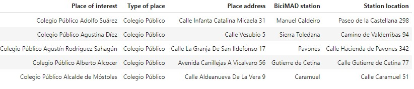

# project-module-1
Ironhack Madrid - Data Analytics Part Time - Feb 2023 - Project Module 1

# :raising_hand: **BiciMAD SCHOOL**

BiciMAD SCHOOL the app for finding Bike stations near to your school in Madrid.

### :information_source: **INTRODUCTION**
Do you want to ride from your school to any place? BiciMAD SCHOOL is your adventurous buddy. 
This app is created specifically for students lovers of riding a bike. Do you want to go to the library? Going to de-stress in a park? Enjoy the city colaborating with the environment? BiciMAD SCHOOL is your to go app.

### :baby: **SPECIFICATIONS**
This is an Ironhack Data Analytics Bootcamp Final Project.  Module 1. 
BiciMAD SCHOOL provides information with two options:
* Gives you a complete table in which students can find the public school with its address, the closest BiciMAD station and its location.
* Gives you the possibility of writing the public school and it will return the location of the closest BiciMAD Station.
- Further updates are expected

### :bulb: **OUTPUT**
* CSV file with all colegios públicos and the nearest BICIMAD station.
* CSV file with the nearest BICIMAD station to a specific colegio público.



### :computer: **TECHNOLOGY STACK**
* Python 
* SQL
* API Rest
* Pandas
* Numpy
* Requests
* Shapely
* Geopandas
* Jupyter notebook
* Visual Studio Code
* Argparse

### :file_folder: **FOLDER STRUCTURE**
```
└── project
    ├── data
    ├── modules
    │   ├── geo_calculations.py
    │   └── module_functions.py
    ├── notebooks
    │   ├── m_acquisition.ipynb
    │   └── m_analysis.ipynb
    │   └── m_wrangling.ipynb
    │   └── pm1_notebook.ipynb
    ├── p_acquisition
    │   ├── m_acquisition.py
    ├── p_analysis
    │   ├── m_analysis.py
    ├── p_wrangling
    │   ├── m_wrangling.py
    └── presentation
    └── project_process
    └── query
    └── .gitignore
    └── README.md
    └── main.py

```
### :love_letter: **CONTACT INFO**
[LinkedIn](https://www.linkedin.com/in/margarita-montenegro-data-analyst/)